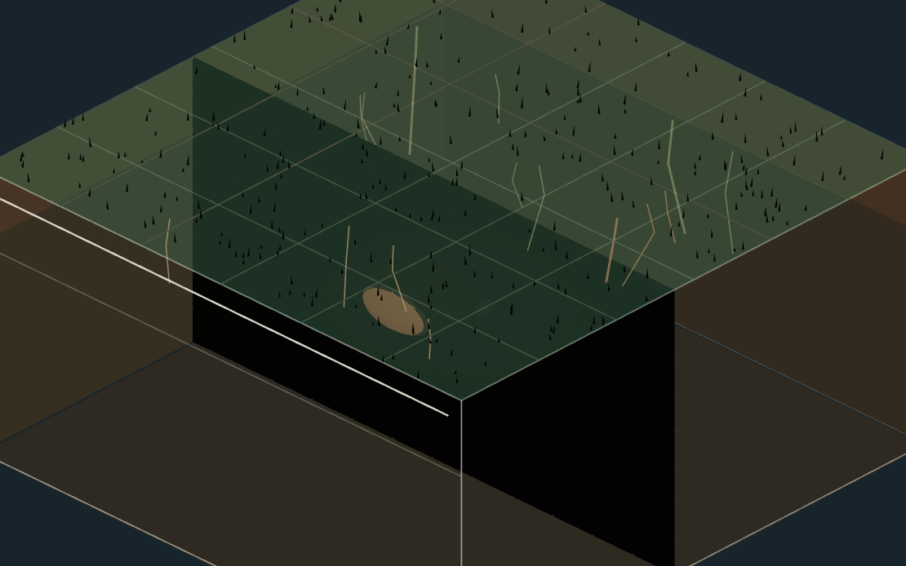

# Zombie Fire Suppression Sim

**Exploratory animation — reduced, unvalidated physics.**

A local browser application for exploring a buried dry-ice source, finite heater input, peat smoldering, and slow gas/heat transport under a 20 ft × 20 ft (6.096 m × 6.096 m) grass surface. A separate bounded radial event shows an illustrative short-time gas/soil response. These reduced calculations compare assumptions and numerical behavior; they do not establish whether a field treatment would suppress a fire, fracture soil, or be safe.

Private repository: [KadenCSmith/zombie-fire-suppression-sim](https://github.com/KadenCSmith/zombie-fire-suppression-sim).

## Run locally

On a Mac with Node.js 22.12+ and npm, double-click [run-mac.command](run-mac.command) in Finder. It installs the locked dependencies when needed, starts the app on a local port, and opens **Safari**. Keep the Terminal window open while using the app; close it or press Control-C to stop the server. The simulation needs no API key or cloud service.

From Terminal, the same Mac launcher is:

```sh
npm run mac
```

For manual browser launch on any supported system:

```sh
npm ci
npm run dev
```

Open the local URL printed by Vite. To run checks or prepare a static build:

```sh
npm run typecheck
npm run lint
npm test
npm run build
npm run preview
```

Dependency versions are pinned in `package.json` and `package-lock.json`; `npm ci` installs the locked set.

## Example scenarios

All examples use the same 6.096 m square domain and an explicitly assumed property set. They are demonstration inputs, not measured field cases or tuned proof of suppression.

| Scenario | Change from the heated-source demonstration |
| --- | --- |
| [Untreated smoldering](examples/untreated.json) | Same initial hot peat; dry-ice mass set to zero and heater off. |
| [Buried dry ice, heater off](examples/dryIceOnly.json) | Finite buried dry ice exchanges heat with its surroundings without heater input. |
| [Heated buried dry ice](examples/heatedDryIce.json) | Same initial peat and source with its finite scheduled heater. |
| [Wet, low permeability](examples/wetLowPermeability.json) | Higher assumed water saturation and lower assumed intrinsic permeability. |
| [Hypothetical edited pathway](examples/hypotheticalPathway.json) | A manually assumed higher-permeability pathway; it is **not** predicted by soil motion. |

For a meaningful A/B comparison, keep the same initial hot region, random seed, grid, and display scales, then change one assumption. The outcome depends on the reduced model and must not be interpreted as a field success rate.

The linked JSON files can be selected through **Import**. They carry the schema version, model identity, unit metadata, seed, and input provenance used for repeatable runs.

## Scene screenshots

This PNG export of the 3D canvas was captured during local browser inspection. The surrounding controls, labels, and diagnostics are visible in the running app rather than in the canvas export.



## Controls

- **Scenario setup:** choose a demonstration preset, then edit Source, Ground, Fire, Air, or Model controls. Ground editing includes mineral composition, physical soil layers, peat regions, supplemental root fuel, moisture, and permeability. Fire includes initial hot regions and assumed pathways. Scenario changes restart the physical run after a short debounce; the heater on/off switch is recorded as a live operational event. The Source tab also offers a one-click **Convert remaining solid CO₂ and view event** intervention; its distinct limits are described below.
- **Scene:** choose 3D orbit, top, X section, or Y section; drag to orbit and scroll to zoom. Use the clipping slider to move the displayed slice. Select a field overlay and choose fixed or adaptive color scaling. Toggle modeled flow arrows and visible roots. Click a colored cell to place the virtual sensor.
- **Comparison:** the A/B button runs an otherwise identical heater-off baseline beside the current scenario. The two runs use the same initial seed and matching field names; inspect matched physical times and fixed color scales before comparing colors.
- **Time:** play/pause, take one physical solver step, reset, compute to the selected duration, or run to a chosen hour. One-, three-, and seven-day windows are available. The solver pace defaults to **30 simulated seconds per real second** and can request 120, 600, or 3600; the fast-forward button selects 3600. The worker reports achieved throughput, which may be lower than the requested pace. Drag the recorded checkpoint slider or select a separate timestamp-based playback pace of 30, 120, 600, or 3600 simulated seconds per real second to inspect saved states without advancing the solver.
- **Motion:** trigger a separate visual opening/settling sequence. Its artistic movement setting does not change the solver or generate a predicted pathway.
- **Short event:** the Event tab computes a separate radial gas calculation from the current slow-run state for up to 2 simulated seconds, with a separate clock and at most 100 recorded frames. The Source conversion button starts this event after the numerical solid-to-gas conversion. Inspect pressure, CO₂, and illustrative damage shell overlays; scrub or replay the separate event at 0.1–4× speed, or export its frames and assumptions as JSON.
- **Files:** import or export a scenario JSON; export sparse history as CSV, scene image as PNG, or recorded states as JSON. Invalid scenario imports report validation errors. The States JSON is an export of saved snapshots, not a simulator checkpoint that the UI can resume.

The right panel shows current source mass, heater input, peak temperature, remaining fuel, sensor values and histories, and expandable mass/energy diagnostics. See the status labels beside each subsystem before interpreting an overlay.

## What the displays mean

- The 3D soil and grass scene and colored overlays visualize a coarse grid beneath the surface. Their colors are display choices; CO₂ itself is not colored. A slice or cutaway exposes subsurface values.
- The buried source is shown as a volume-equivalent sphere. Its shrinking display does not resolve cavities, contact resistance, or a spherical solid interface.
- The heater input is volumetric heat generation `q'''` in W/m³ over a fixed numerical support volume. Total power is derived from that volume. An editable heater setting is an energy input, not a temperature difference.
- The one-click conversion consumes all remaining modeled solid CO₂ at the current solver time and adds the same mass as pore gas. Its estimated warming, latent, and gas-equilibration costs are booked as **external intervention energy**; this control bypasses the ordinary energy-limited sublimation rate and does not extract that energy from the soil. It may immediately pause slow-flow transport on a pressure-validity warning. The ensuing short event is a reduced radial gas calculation with an uncalibrated soil-response indicator; it is not a validated blast, fracture, or movement prediction.
- The displayed pressure-load number multiplies modeled near-source excess pore pressure by a fixed, imagined support-plane area. It is a labeled algebraic proxy in newtons, not a calculated force on a real soil surface or a rupture forecast. Values shown after a validity pause are outside the supported model range.
- The slow gas/thermal calculation and the independent soil-motion illustration have different statuses. Visual cracks or shifting pieces do not result from a calculated rupture threshold. Any manually assumed pathway geometry is a separate hypothetical transport case.

## Model limits and documents

The combustible fuel is represented by an uncalibrated, cellulose-like complete-oxidation surrogate. Char and ash are not modeled inventories in this release. Peat-specific kinetics, heterogeneous moisture/flow measurements, source-scale phase behavior, and experimental validation remain open work. The model stops if a configured low-speed gas or thermodynamic validity check fails; it must not be interpreted as a blast or geomechanics calculation.

- [Physics model](docs/PHYSICS_MODEL.md): equations, units, boundaries, numerical treatment, and diagnostics.
- [Short-time event model](docs/FAST_EVENT_MODEL.md): radial gas calculation, illustrative soil-response indicator, and separate validity limits.
- [Parameter reference](docs/PARAMETER_REFERENCE.md): bases, default values, ranges, and provenance.
- [Sources](docs/SOURCES.md): primary references and reuse choices.
- [Validation status](docs/VALIDATION_STATUS.md): what was checked and what remains unvalidated.
- [Build status](docs/BUILD_STATUS.md): requirement-by-requirement delivery and next tasks.
- [Physics roadmap](docs/PHYSICS_ROADMAP.md): experiments and model work needed before engineering use.
- [Third-party notices](THIRD_PARTY_NOTICES.md): direct runtime dependency licenses.

## License

No license has been selected for this project's original code. Third-party dependencies retain their own terms.
