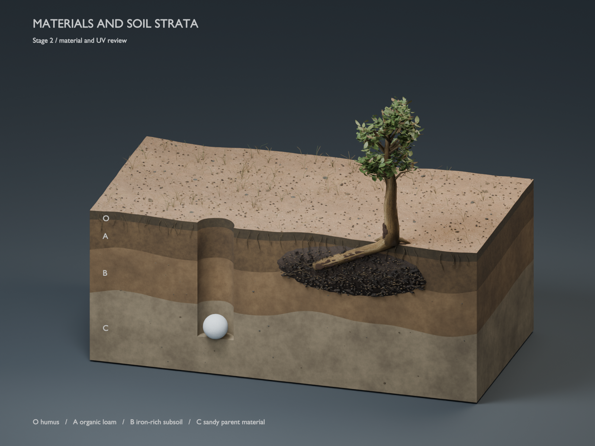
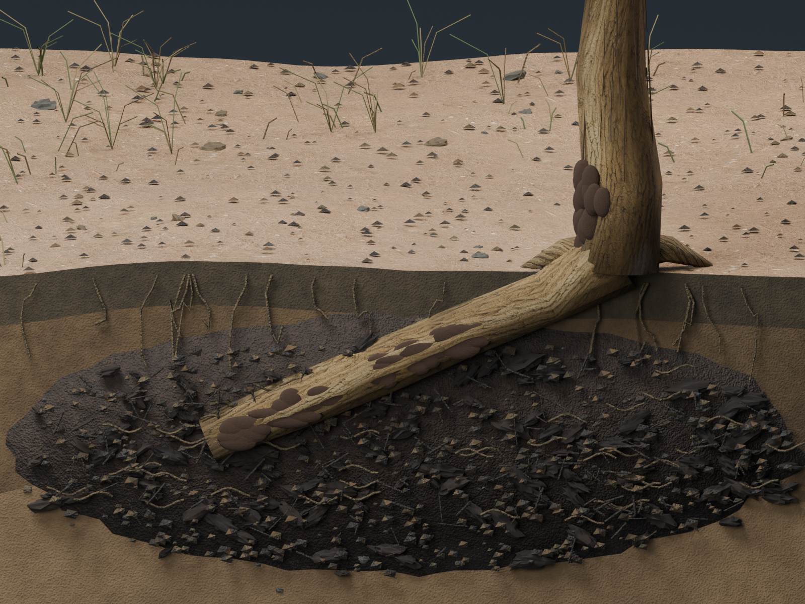
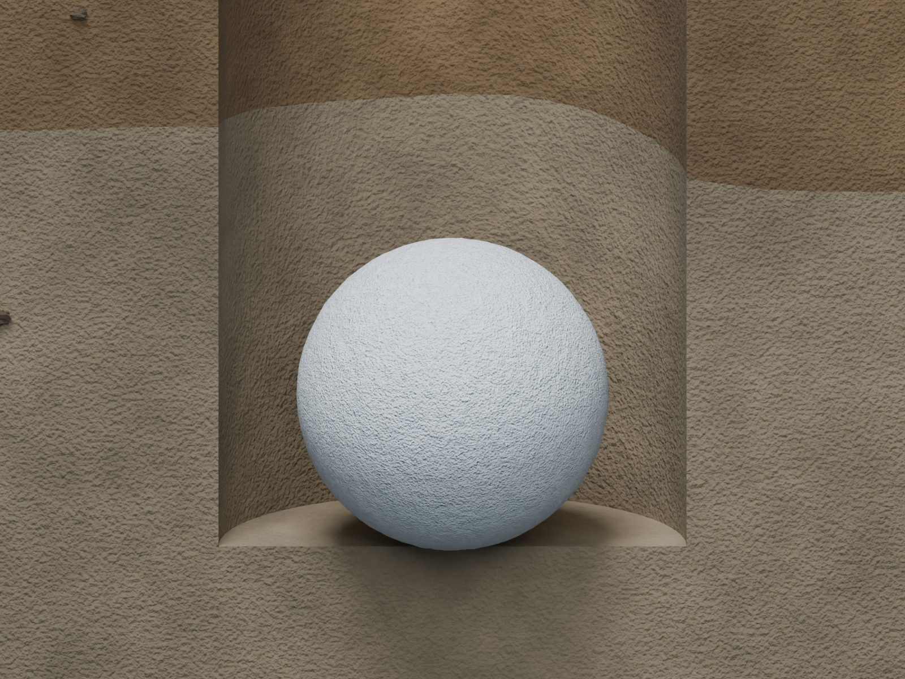
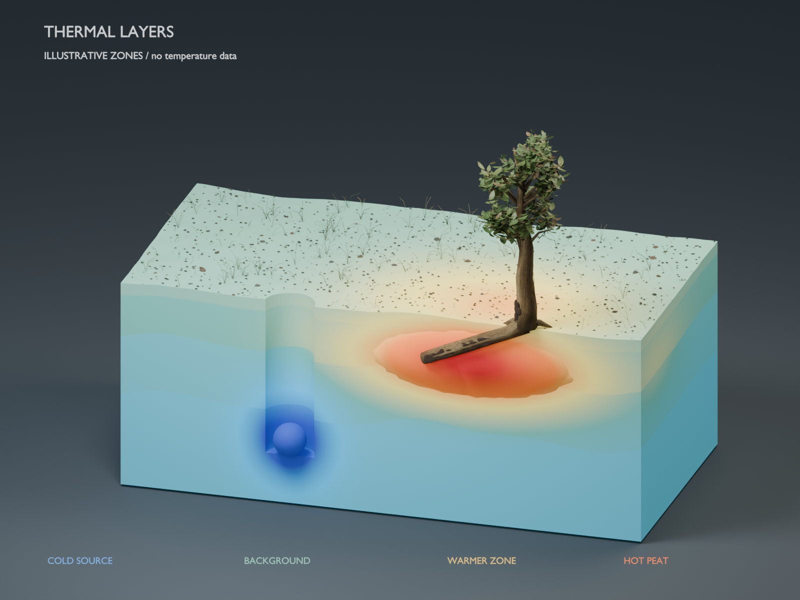
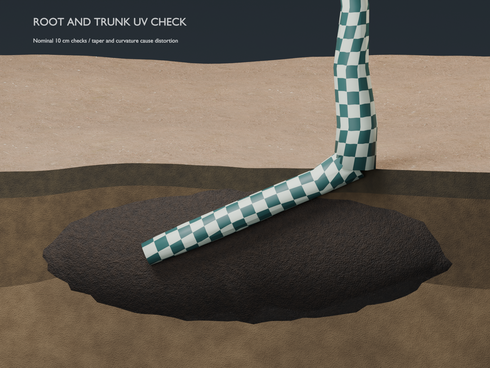

# Stage 2 — materials, UVs and thermal layers

**Ready for user approval.** Stage 1 geometry was approved. The user requested
both soil strata and a thermal overlay. Stage 3 rig and deformation work begins
after this material/UV review is approved.

## Open the candidate

[Materials_Thermal_Stage_2.blend](review/material-stage2/Materials_Thermal_Stage_2.blend)
opens on the material camera view in Blender 4.2.3. All six image maps are packed.
Use the Scene dropdown at the top right to choose:

| Scene | Review purpose |
| --- | --- |
| 01 MATERIALS • Stage 2 | Natural bark, char, peat, frost, foliage and distinct O/A/B/C soil strata |
| 02 THERMAL • illustrative | Static cold-source and warm-peat overlay, with a qualitative legend |
| 03 UV CHECK • Stage 2 | Root/trunk mapping with nominal 10 cm checks |

The file contains START HERE and ASSET CREDITS text blocks. Original SECTION and
TOP view layers remain available in the material scene. The material review
layer hides inherited fire, gas and shockwave effects for surface inspection.
Original animation actions remain in the file, without Stage 3–5 approval.

## Material and layer review



The four soil strata retain their approved geometry: O humus, A organic loam,
B iron-rich subsoil and C sandy parent material. These are conceptual material
labels; site-specific stratigraphy and measured layer properties are absent.
The upper surface receives forest-floor image detail while section faces retain
distinct procedural soil textures. Bark uses meter-scaled image mapping, char
receives a shallow crack bump, and the sphere retains procedural frost.





The inherited rounded char patches remain a stylized surface treatment. The
root and trunk are separate overlapping meshes; Stage 2 does not establish their
deformation behavior. Review lighting is provisional and can change in Stage 6.

## Thermal overlay



The overlay uses a prescribed dimensionless field at frame 66: a cool region
around the dry-ice sphere, a warm region around the peat, and slight baseline
color differences between strata. Colors have **no kelvin or Celsius values**.
They are not imported from the numerical simulator and do not solve conduction,
freezing, gas transport, combustion or suppression. The thermal scene's playback
range is fixed at frame 66. Its labels explicitly state that no temperature data
are present.

Thermal materials are overrides on separate review objects that share the
approved geometry. Natural materials stay independently selectable. Gaussian
centers, radii and color weights in the builder are artistic display parameters,
not researched physical coefficients. Solver-based thermal layers remain a
separate future integration requiring matched geometry and field mapping.

## UV review



79 bark objects received ring-perimeter/arc-length UVs at one tile per meter,
with rear seams and planar caps. Eight soil meshes use face-oriented planar
maps at one tile per two meters. All 918 leaves use UVs following their pointed
outline and raised midrib. Tile repetition and shared overlapping leaf islands
are intentional; this is not a unique texture-baking atlas.

| Inspected surface | Median stretch ratio | 95th percentile | Maximum |
| --- | ---: | ---: | ---: |
| Main root | 1.108 | 1.817 | 2.320 |
| Trunk | 1.141 | 1.434 | 1.681 |
| Curved foliage | 1.045 | 2.020 | 2.407 |

The ratio is the larger divided by the smaller singular value of the local
UV-to-surface mapping; 1 means locally isotropic mapping. Taper, curvature and
caps retain distortion. Root, trunk, soil and foliage checks found finite UVs
and no collapsed UV triangles on nondegenerate geometry. Full per-object
metrics and packed-image hashes are in
[material_checks.json](review/material-stage2/material_checks.json).

## Texture sources and why they were used

| Source | Why this source was needed | Scope |
| --- | --- | --- |
| Rob Tuytel, [Bark Brown 01](https://polyhaven.com/a/bark_brown_01), Poly Haven | Supplies consistent diffuse, bump and roughness detail aligned along the root/trunk, with a documented 1 m texture scale | Visual surface reference only |
| Rob Tuytel, [Forrest Ground 03](https://polyhaven.com/a/forrest_ground_03), Poly Haven | Supplies surface litter detail at a documented 2 m scale so the upper soil face differs from exposed section faces | Visual surface reference only |

Both assets are distributed under [Poly Haven's CC0 license](https://polyhaven.com/license).
The six 2K JPEG maps are packed into the scene; diffuse is sRGB, bump and
roughness are Non-Color. Exact download URLs are retained in
[asset_sources.json](review/material-stage2/asset_sources.json).
These visual references do not replace the separately requested peer-reviewed
physics report with ASCE citations, which remains pending in the
[continuation plan](STAGED_REVIEW.md#continuing-numerical-and-research-work).

## Verification and preservation

The final file passes 13 reopening checks. All 885 original mesh fingerprints
and 104 animation-action fingerprints match the approved Stage 1 candidate;
sphere positions and dimensions match at 13 sampled frames. The six texture
maps remain packed after reopening. Both source scene files retain their hashes.
See [reopen_verification.json](review/material-stage2/reopen_verification.json)
and [preview_manifest.json](review/material-stage2/preview_manifest.json).

Five 1600 × 1200 previews were rendered with CPU Cycles, 24 samples, frame 66,
and inspected. The final workspace save changes only how the candidate opens;
the manifest records both file hashes. Native Blender showed the material view
and the selectable thermal scene. The previous unsaved GUI session was saved
as a local backup in the ignored work directory before switching files.

The simulator's 59 tests, typecheck, lint and production build passed. No solver
or physical parameter changed in this stage. The reserved final four-frame
render/review attempt remains available for Stage 6.

## Reproduce

Build into a new directory so an existing review file is never overwritten:

```sh
blender -b docs/review/static-model/Static_Model_Stage_1.blend \
  --python-exit-code 1 --python scripts/blender_material_stage2.py -- \
  --assets /path/to/texture-maps-and-sources-json --output /path/to/new-stage2-review
```

Use the existing map filenames and the `sources.json` manifest from the original
Blender project's assets directory. The checked-in candidate already contains
packed copies. Reopen verification is run from this repository:

```sh
blender -b docs/review/material-stage2/Materials_Thermal_Stage_2.blend \
  --python-exit-code 1 --python scripts/verify_blender_stage2.py
```

Approval is for the material appearance, layer readability, qualitative thermal
palette and UV mapping shown here. It does not approve motion or thermal physics.
