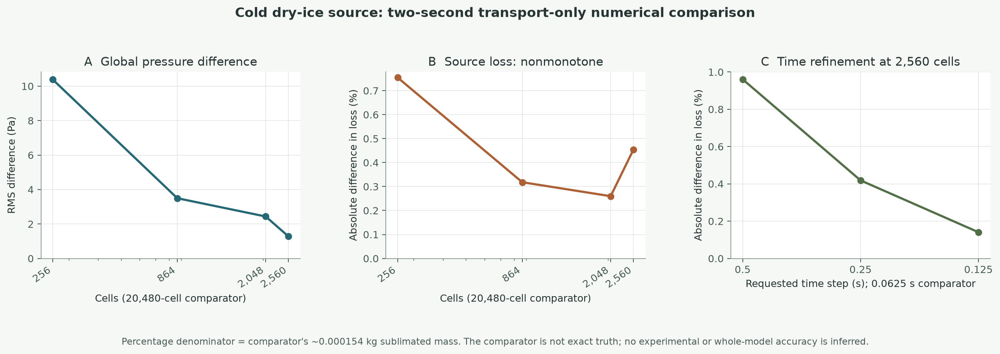
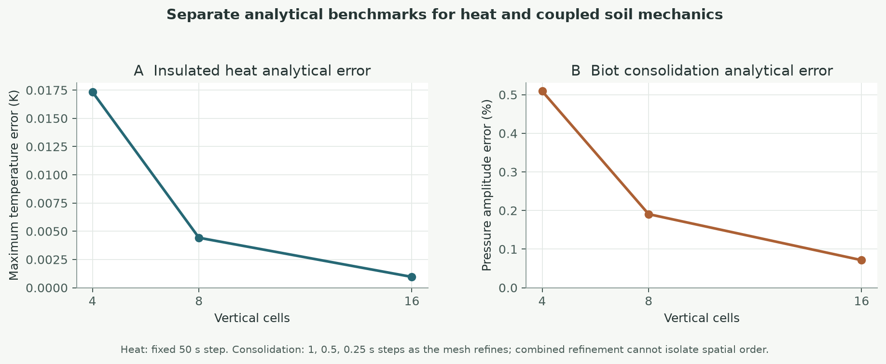

# Physical equations, article correspondence, and numerical evidence

**Audit date:** 1 October 2026. **Code base:** 0.16 `main` at `e1468df`, before this documentation and navigation update. This is an equation and evidence map, not a claim of field validation. The app's *Physics formulas* view is a readable companion to this source-linked record.

## What the supplied paper actually supports

[An et al., *Fire* 8(1), 13 (2025)](https://doi.org/10.3390/fire8010013) study methane/air migration in a coal mine and porous goaf. Their working-face calculation uses ANSYS Fluent, cell-centered **finite volume CFD** (§2.1.2, Eqs. 20–28). The paper's stated species system is nonreactive (§2.1.1). It does not model peat, dry ice, water application, soil deformation, or fire suppression. We therefore compare only equation families that really overlap:

| Supplied article | Corresponding code | Judgment |
|---|---|---|
| Ideal-gas closure, Eq. 12 | [`src/coupled/model.ts`](../src/coupled/model.ts#L112-L117) uses $p=nRT/V_g$ for a four-component pore gas | Same thermodynamic ideal-gas family, with different geometry and mixture implementation. |
| Porous Darcy seepage, Eq. 42 | [`src/coupled/model.ts`](../src/coupled/model.ts#L176-L210) uses intrinsic permeability, gas relative permeability and gravity in a face-flux pressure solve | Relevant low-speed porous-flow analogy. The paper's coal/goaf coefficients do **not** calibrate peat. |
| Gas-species balance/diffusion, Eqs. 39–41; conservative FVM, Eqs. 20–28 | [`src/coupled/model.ts`](../src/coupled/model.ts#L203-L225) upwinds species advection and uses shared diffusive face fluxes | Same broad balance principle; different species, boundaries, reaction sources and discretization details. |
| Navier–Stokes, turbulence and inertial porous resistance, Eqs. 1–19 and 52–62 | No corresponding resolved airflow/turbulence solver | **Not implemented.** This code instead rejects pore Reynolds number $>1$ or Mach $>0.05$ in the coupled transport regime. |

The applicable equations are a **subset**, not most of An et al.'s coal-ventilation model. In particular, importing their turbulence closure into slow pore gas would change the modeled regime without evidence. Peat combustion and water treatment require separate references [2–4, 10–12].

## What kind of simulation this is

“FEV” is not the method name used here. **FVM** means finite volume method; **FEM/FEA** means finite element method/analysis. The application is a hybrid of several calculations and an authored presentation:

| Workspace or layer | Numerical method | What it actually predicts |
|---|---|---|
| Coupled continuum / physics lab | Cell-centered 3D FVM for gas, heat, species and local phase inventory; eight-node brick FEM for small-strain soil; reduced Ritz cap | Bounded porous pressure, temperature, inventories, displacement and optional diffuse damage under assumed materials and geometry. [`COUPLED_MODEL.md`](COUPLED_MODEL.md). |
| Accepted long fire calculation shown in the sequence | 3D FVM transport/reduced oxidation, with mechanics and cap disabled | A numerical history of selected fields, **without** a resolved subsurface smoldering front or a liquid infiltration solve. [`src/coupled/fireProtocol.ts`](../src/coupled/fireProtocol.ts), [`FIRE_PROTOCOL.md`](FIRE_PROTOCOL.md). |
| Local dry-ice/water contact shown in the sequence | Lumped contact heat-and-inventory calculation | Heat and mass budgets of assumed hot specimens; separate from the accepted FVM field. [`src/story/contactCooling.ts`](../src/story/contactCooling.ts), [`CONTACT_COOLING.md`](CONTACT_COOLING.md). |
| Natural cutaway, hose paths, rapid release, equipment movement | Authored animation and prescribed paths, with some reduced event/particle models | A visual sequence; its wetting pattern, rapid release and excavation are not output of 3D water-flow, blast or terrain-failure equations. [`FIRE_SEQUENCE.md`](FIRE_SEQUENCE.md). |
| `src/physics-next/*` packages | Standalone proposed/verified kernels and contracts | **Not imported by the active solver.** In particular, the Richards/van Genuchten water module is not active infiltration in the picture. [`TRANSPORT_PACKAGE_INTEGRATION.md`](TRANSPORT_PACKAGE_INTEGRATION.md). |

### Gas and porous soil flow

The active pore-gas closure is $p=nRT/V_g$, with gas-accessible pore volume $V_g$ excluding liquid/ice/source solid. A face's Darcy-type flux is proportional to

$$\mathbf u_g=-\frac{k\,k_{rg}}{\mu_g}(\nabla p-\rho_g\mathbf g),\qquad
k_{rg}=\left(\frac{V_g}{V_p}\right)^3.$$

The code also rescales intrinsic permeability with the normalized factor $(\phi/\phi_0)^3[(1-\phi_0)/(1-\phi)]^2$ ([`model.ts`](../src/coupled/model.ts#L178-L201)). Its form is **Kozeny–Carman inspired** [5], but the normalization and cubic gas-filled fraction are model closures, not calibrated peat laws and not equations copied from An et al. [1]. Species are updated through each common face using an upwind advective amount plus mole-fraction diffusion, schematically $\dot n_{s,f}=\dot n_f x_{s,\mathrm{up}}+D_f(x_{s,a}-x_{s,b})$ ([`model.ts`](../src/coupled/model.ts#L203-L225)). Shared face accounting was chosen to conserve inventories. A full Navier–Stokes/turbulence solver would be appropriate only for a separately resolved free-air/borehole regime; this solver is explicitly bounded to low-speed porous flow [1].

### Heat, water phases, and dry ice

For neighboring cells, conduction is $\Delta E_a=\Delta t\,\bigl(2k_a k_b/(k_a+k_b)\bigr)(A/d)(T_b-T_a)$, with equal and opposite energy in cell $b$ ([`model.ts`](../src/coupled/model.ts#L138-L156)). Surface/bottom exchange is a Robin $hA(T_\infty-T)$ term. The code stores **internal energy** and inverts it to temperature while partitioning local water between vapor, liquid and ice; vapor saturation uses Murphy–Koop below freezing and a liquid-water saturation correlation above it ([`thermodynamics.ts`](../src/coupled/thermodynamics.ts#L1-L67), [6]). The active liquid/ice inventory is stationary: there is no liquid Darcy/Richards flux.

The finite dry-ice source uses $A_s=4\pi r^2$ with $r=(3m/4\pi\rho_s)^{1/3}$, contact heat $Q_c=h_cA_s(T_{\rm soil}-T_s)\Delta t$, and a solid–vapor equilibrium approximation

$$p_{\rm sat}(T_s)=p_0\exp\!\left[\frac{L_m}{R}\left(\frac{1}{T_0}-\frac{1}{T_s}\right)\right].$$

Its bounded spherical-film source uses $k_m=D_{\rm eff}/r$ and a Stefan carrier-depletion logarithm $\ln[(1-y_\infty)/(1-y_s)]$ while solving a finite mass/energy balance ([`source.ts`](../src/coupled/source.ts#L38-L165)). Spalding [16] supports the carrier-depletion mass-transfer form; Giauque and Egan [7] support the phase reference/latent heat; Purandare et al. [8] support pressure/CO₂-fraction dependence. The buried contact coefficient, effective diffusivity, spherical inclusion and subgrid distribution are still assumptions; none of these papers validates the application's burial geometry.

### Fire and chemical reaction

The active reaction is a **one-step cellulose-like surrogate**, $\mathrm{C_6H_{10}O_5+6O_2\rightarrow6CO_2+5H_2O}$, with finite oxygen/fuel and

$$r=A_{\rm ref}\exp\!\left[-\frac{E_a}{R}\left(\frac1T-\frac1{T_{\rm ref}}\right)\right]
\frac{x_{O_2}}{x_{O_2}+K_{O_2}}\exp(-w_{\rm dry}).$$

Here $w_{\rm dry}$ is condensed-water mass divided by dry solid mass; the exponential moisture penalty and rate coefficients are assumptions ([`model.ts`](../src/coupled/model.ts#L162-L170)). This form gives a finite, oxygen-limited research surrogate without a fitted multistep mechanism. Huang and Rein's peat studies [2, 3] instead model drying, pyrolysis, peat oxidation and char oxidation, with measured context. The current model cannot predict a verified spreading smoldering front, CO/char yields or an extinction threshold. The pictured flame and spread remain separate authored cues.

### Soil, roots and cap

The mechanical bricks use small-strain elasticity $\boldsymbol\sigma'=\mathsf C:\boldsymbol\epsilon$ and element stiffness $K_e=\int_{V_e}B^T\mathsf C B\,dV$. Pore-pressure load is the work-conjugate $\int B^T\alpha\Delta p\mathbf I\,dV$; pore volume responds as $\Delta V_p=\alpha V\,\mathrm{tr}(\boldsymbol\epsilon)$ ([`mechanics.ts`](../src/coupled/mechanics.ts#L45-L59), [`engine.ts`](../src/coupled/engine.ts)). Biot [9] supports the linear poromechanical coupling form, not the assumed peat modulus or $\alpha$. Optional fracture uses an AT2-type diffuse energy $\int G_c[d^2/(2\ell)+\ell|\nabla d|^2/2],dV$ inspired by Miehe et al. [10], but its mesh energy comparison **fails** the preset 5% gate at about 5.74%; the default coupled fracture continuation fails an energy gate. A diffuse damage field is not a verified open crack. The cap is a reduced Ritz shallow-shell/contact model, not a shell FEM mesh or measured installed structure ([`cap.ts`](../src/coupled/cap.ts), [`COUPLED_VALIDATION.md`](COUPLED_VALIDATION.md)).

### Water dispersion and suppression

The active sequence's water supply is split into **prescribed** local contact shares and bypass; the local calorimeter conserves $m_w$ and a sensible/latent heat budget ([`contactCooling.ts`](../src/story/contactCooling.ts#L83-L125)). It was chosen to show finite cooling without claiming a solved wetting front. The usual unsaturated-flow alternative, **not currently active**, is a mass-conservative Richards equation with water retention and relative hydraulic conductivity [11, 12]. With upward-positive $z$ and liquid pressure head $h$, one conventional form is

$$\frac{\partial\theta}{\partial t}=\nabla\!\cdot\!\left[K(h)\nabla(h+z)\right]-S_w,
\qquad K(h)=K_s S_e^{\ell}\left[1-(1-S_e^{1/m})^m\right]^2,
\quad m=1-1/n.$$

Here $S_e$ is effective liquid saturation and $S_w$ is a specified extraction term; the sign changes if depth is taken positive downward. The van Genuchten–Mualem closure appears in the **inactive** `physics-next` water module ([`waterTransport.ts`](../src/physics-next/transport/waterTransport.ts#L44-L100)); its $\alpha,n,S_r,\ell$ and dry-end cap need matched peat measurements before integration. Significant evolving gas pressure, vaporization and freezing would also require coupled multiphase treatment rather than silently appending passive-gas Richards flow. Santoso et al.'s peat suppression experiment [4] is a useful future **validation target**, not a source of this app's contact coefficients or an error percentage.

## Convergence plots and defensible error estimates

The three panels replot the archived, reproducible [`convergence-study.json`](review/unified/convergence-study.json) and [`convergence-study.md`](review/unified/convergence-study.md). Each run is a **2 s cold source-only transport** calculation with mechanics, cap and reaction absent. The 20,480-cell and 0.0625 s runs are fine **comparators**, not exact solutions. The percentage denominator for sublimated mass is the comparator's tiny ~0.000154 kg *loss*, not 4 kg remaining source. Spatial global pressure RMS differences fall 10.385→3.496→2.436→1.276 Pa over 256→864→2,048→2,560 cells, but source-loss differences are 0.7545→0.3180→0.2598→0.4547% in absolute value. Thus **overall spatial convergence is not established**. The fixed-probe pressure is also nonmonotone.

At fixed 2,560 cells, the measured source-loss differences from the 0.0625 s comparator are 0.9607%, 0.4187% and 0.1407% for 0.5, 0.25 and 0.125 s requests. A *conditional* three-level Richardson extrapolation [13, 14], using the actual 0.25/0.125/0.0625 s source-loss values $q_1=0.0001536234865$, $q_2=0.0001540523291$, $q_3=0.0001542694294$ kg, gives

$$p=\frac{\ln |(q_1-q_2)/(q_2-q_3)|}{\ln 2}=0.9821,\quad
q_{\Delta t\to0}\approx q_3+\frac{q_3-q_2}{2^p-1}=0.0001544920\;\mathrm{kg}.$$

This implies approximately **0.285% temporal discretization difference** for that one mass-loss quantity at 0.125 s, relative to the extrapolated value (0.144% at 0.0625 s). It assumes a smooth asymptotic trend and fixed spatial representation; the spatial nonconvergence means it is **not** the total numerical error, a confidence interval, or an estimate of physical suppression accuracy. A formal grid convergence index or a certified model-wide error bar is not justified by these data.

The second figure replots independent analytical checks from [`coupledSensitivity.json`](../examples/coupledSensitivity.json) and [`coupledValidation.json`](../examples/coupledValidation.json): insulated 1D heat maximum error declines 0.01733→0.004424→0.000956 K at 4/8/16 vertical cells with fixed 50 s steps; linearized Biot consolidation pressure-amplitude error declines 0.509→0.191→0.0713% with **both** mesh and timestep refined. Those checks verify selected equations under simplified fixtures. The combined consolidation sequence cannot identify a spatial order by itself. The long 24 h fire sequence, moving front, water paths and optional fracture have no passing end-to-end convergence/validation result. Roache [13], Celik et al. [14] and Oberkampf and Trucano [15] distinguish numerical verification from experimental predictive validation.

**Overall model prediction error: unknown.** There is no independent matched peat-fire/suppression holdout dataset with measured geometry, initial conditions, moisture, material properties, applied source/water history and time-resolved outputs. Assigning a whole-model ±percentage would invent evidence.

The graphs can be regenerated from committed JSON using `python scripts/plot-physics-audit.py` with `matplotlib`; the script plots archived output and does not silently perform new simulations.

## Steps needed before a credible field-accuracy claim

1. **Measure a matched peat specimen and apparatus.** Record density, fiber/mineral fraction, moisture basis and retention, permeability, thermal properties, oxidation kinetics, modulus/strength, geometry, boundaries, source contact and water delivery, each with uncertainty. Set aside independent holdout trials [2–4, 11–12].
2. **Resolve the physical processes that decide treatment.** Fit and test multistep peat drying/pyrolysis/oxidation/char chemistry, mobile liquid/vapor/ice transport, actual borehole/excavation and water inlet, heat transfer under the cap, and oxygen/CO₂ gas properties in the selected regime. Do not activate `physics-next` kernels merely because their unit tests pass.
3. **Repeat numerical studies on the target outputs.** Independently refine space, time, source/peat atlas and boundaries for the full 24 h fire/treatment trajectory; add temperature, oxygen, CO₂, front position, water retained and source mass as observables. Repeat FEM/fracture/contact refinement and clear the existing failed energy gates before interpreting rupture [13–15].
4. **Validate and quantify predictive error.** Compare preregistered output definitions against independent measured trials, propagate uncertain measured inputs, and report bias, interval coverage and per-output percent/absolute errors. Report near-zero outcomes with absolute errors. Only then assign a physical accuracy range [15].

## Peer-reviewed references

1. An, H., Gong, R., Liang, X., and Wang, H. (2025). “Numerical Simulation Study on Gas Migration Patterns in Ultra-Long Fully Mechanized Caving Face and Goaf of High Gas and Extra-Thick Coal Seams.” *Fire*, 8(1), 13. [doi:10.3390/fire8010013](https://doi.org/10.3390/fire8010013).
2. Huang, X., and Rein, G. (2014). “Smouldering combustion of peat in wildfires: Inverse modelling of the drying and the thermal and oxidative decomposition kinetics.” *Combustion and Flame*, 161, 1633–1644. [doi:10.1016/j.combustflame.2013.12.013](https://doi.org/10.1016/j.combustflame.2013.12.013).
3. Huang, X., and Rein, G. (2017). “Downward spread of smouldering peat fire: the role of moisture, density and oxygen supply.” *International Journal of Wildland Fire*, 26, 907–918. [doi:10.1071/WF16198](https://doi.org/10.1071/WF16198).
4. Santoso, M. A., et al. (2021). “Laboratory study on the suppression of smouldering peat wildfires: effects of flow rate and wetting agent.” *International Journal of Wildland Fire*, 30, 378–390. [doi:10.1071/WF20117](https://doi.org/10.1071/WF20117).
5. Carman, P. C. (1997 republication of 1937 work). “Fluid flow through granular beds.” *Chemical Engineering Research and Design*, 75, S32–S48. [doi:10.1016/S0263-8762(97)80003-2](https://doi.org/10.1016/S0263-8762(97)80003-2). Structural analogy only for the app's normalized permeability factor.
6. Murphy, D. M., and Koop, T. (2005). “Review of the vapour pressures of ice and supercooled water for atmospheric applications.” *Q. J. R. Meteorol. Soc.*, 131, 1539–1565. [doi:10.1256/qj.04.94](https://doi.org/10.1256/qj.04.94).
7. Giauque, W. F., and Egan, C. J. (1937). “Carbon dioxide. The heat capacity and vapor pressure of the solid. The heat of sublimation.” *J. Chem. Phys.*, 5, 45–54. [doi:10.1063/1.1749929](https://doi.org/10.1063/1.1749929).
8. Purandare, A. S., Vanapalli, S., and Verbruggen, W. (2023). “Experimental and theoretical investigation of the dry ice sublimation temperature for varying far-field pressure and CO₂ concentration.” *Int. Commun. Heat Mass Transfer*, 148, 107042. [doi:10.1016/j.icheatmasstransfer.2023.107042](https://doi.org/10.1016/j.icheatmasstransfer.2023.107042).
9. Biot, M. A. (1941). “General theory of three-dimensional consolidation.” *J. Appl. Phys.*, 12, 155–164. [doi:10.1063/1.1712886](https://doi.org/10.1063/1.1712886).
10. Miehe, C., Welschinger, F., and Hofacker, M. (2010). “Thermodynamically consistent phase-field models of fracture.” *Int. J. Numer. Methods Eng.*, 83, 1273–1311. [doi:10.1002/nme.2861](https://doi.org/10.1002/nme.2861).
11. Richards, L. A. (1931). “Capillary conduction of liquids through porous mediums.” *Physics*, 1, 318–333. [doi:10.1063/1.1745010](https://doi.org/10.1063/1.1745010).
12. van Genuchten, M. Th. (1980). “A closed-form equation for predicting the hydraulic conductivity of unsaturated soils.” *Soil Sci. Soc. Am. J.*, 44, 892–898. [doi:10.2136/sssaj1980.03615995004400050002x](https://doi.org/10.2136/sssaj1980.03615995004400050002x). Its relative-conductivity closure builds on Mualem (1976), [doi:10.1029/WR012i003p00513](https://doi.org/10.1029/WR012i003p00513).
13. Roache, P. J. (1994). “Perspective: A method for uniform reporting of grid refinement studies.” *J. Fluids Eng.*, 116, 405–413. [doi:10.1115/1.2910291](https://doi.org/10.1115/1.2910291).
14. Celik, I. B., et al. (2008). “Procedure for estimation and reporting of uncertainty due to discretization in CFD applications.” *J. Fluids Eng.*, 130, 078001. [doi:10.1115/1.2960953](https://doi.org/10.1115/1.2960953).
15. Oberkampf, W. L., and Trucano, T. G. (2002). “Verification and validation in computational fluid dynamics.” *Prog. Aerosp. Sci.*, 38, 209–272. [doi:10.1016/S0376-0421(02)00005-2](https://doi.org/10.1016/S0376-0421(02)00005-2).
16. Spalding, D. B. (1954). “The calculation of mass transfer rates in absorption, vaporization, condensation and combustion processes.” *Proc. Inst. Mech. Eng.*, 168(1). [doi:10.1243/PIME_PROC_1954_168_054_02](https://doi.org/10.1243/PIME_PROC_1954_168_054_02). General mass-transfer formulation, not buried-peat calibration.
