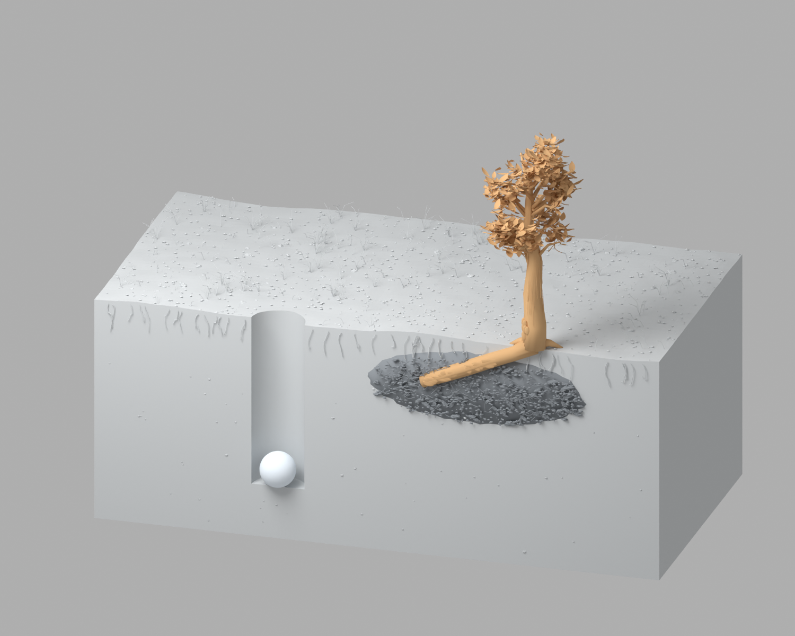
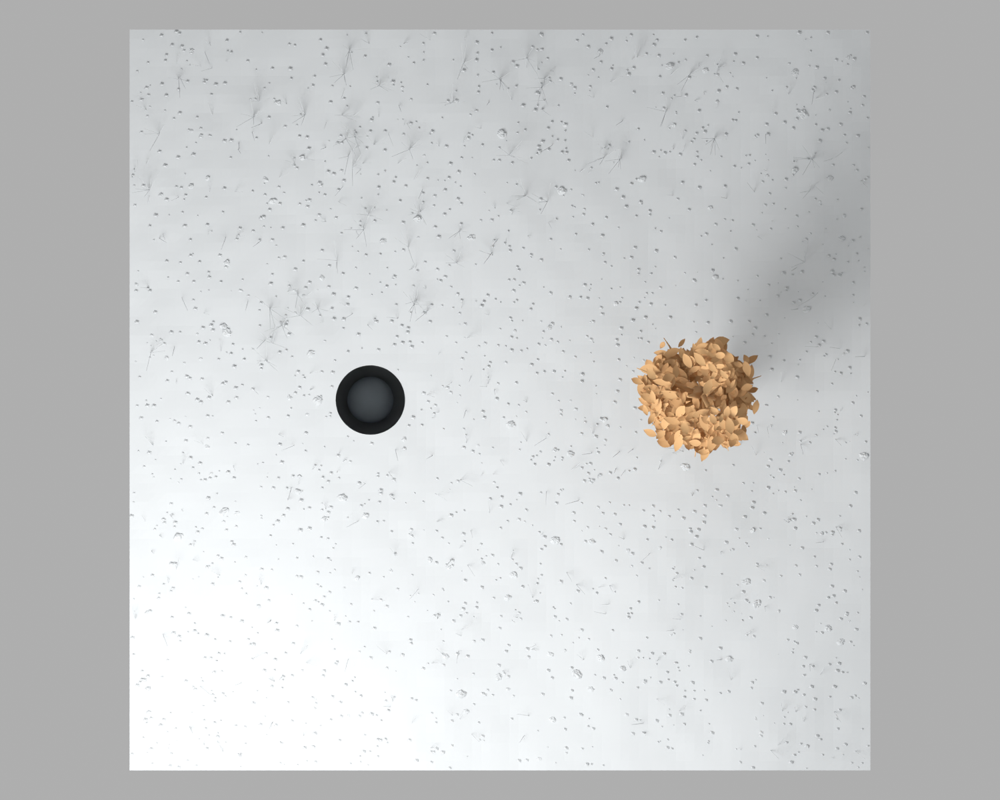
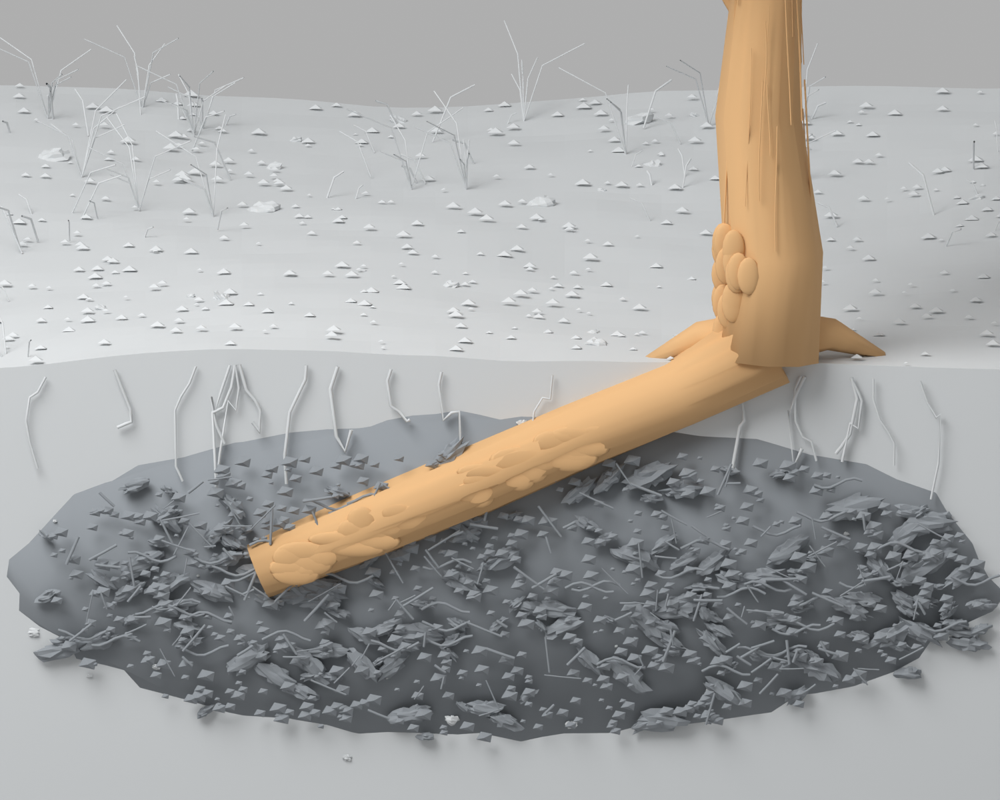

# Blender staged approval

## Current gate

**Stage 1 was approved by the user. Stage 2 is ready for material and UV approval.**
The user requested both distinct soil strata and a thermal overlay. The editable
[Materials_Thermal_Stage_2.blend](review/material-stage2/Materials_Thermal_Stage_2.blend)
contains three selectable scenes: natural materials, illustrative thermal zones,
and a root/trunk UV checker. See [the Stage 2 review](MATERIAL_THERMAL_REVIEW.md)
for images, mapping measurements, asset credits and limitations.

The [approved Stage 1 candidate](review/static-model/Static_Model_Stage_1.blend)
and original stage 07 scene from the private
[dry-ice-peat-study v1.0.0 release](https://github.com/KadenCSmith/dry-ice-peat-study/releases/tag/v1.0.0)
are preserved. The user's six-stage workflow governs further Blender work.

| Stage | Review deliverable | Acceptance decision | Status |
| --- | --- | --- | --- |
| 1 Static model approval | Section, top and root-junction previews; measured dimensions; editable scene | Approve geometry, scale, buried peat placement and root connection | Approved by user |
| 2 Material and UV approval | Soil strata and thermal overlay; surface closeups; UV/stretch inspection | Approve surface appearance and mapping | Awaiting user |
| 3 Rig and deformation test | Transform and deformation tests; object ownership and root/trunk continuity checks | Approve motion controls and deformation behavior | Pending Stage 2 |
| 4 Basic motion blocking | Low-cost preview of fall, release, transport and partial suppression | Approve sequence and broad motion | Pending Stage 3 |
| 5 Camera move and timing | Section/top shot plan, camera paths and timed preview | Approve framing, moves and event timing | Pending Stage 4 |
| 6 Lighting and final render | Final lighting and the remaining four-image Cycles render/review pass | Review final quality and limitations | Pending Stage 5 |

The inherited final-render budget has two completed attempts and one remaining.
Stage 1 geometry previews are not the final lighting/render review. Workbench stalled on this host; the delivered previews use flat-color materials, a neutral fill light, and 12-sample CPU Cycles at frame 66. These temporary preview settings are not saved in the candidate. The remaining
four-frame final review has not been executed during this continuation.

## Stage 1 findings

Measurements come from evaluated mesh vertices, not object labels. See
[measurements.json](review/static-model/measurements.json) for values, tolerances,
source and candidate SHA-256 hashes, and limitations.

| Item | Measured result |
| --- | --- |
| Soil block | 8.000 × 8.000 m footprint; base z = −3.200 m; highest surface detail of the soil mesh z = +0.04924 m |
| Dry-ice sphere | 0.500 m diameter on all three axes |
| Borehole cutter | 0.750 m diameter; floor z = −2.440 m |
| Sphere at rest, frame 66 | Bottom z = −2.440 m; zero measured gap after correction |
| Borehole radial clearance | 0.125 m for the centered sphere |
| Peat lens | Highest vertex z = −0.10860 m; all lens vertices below nominal ground z = 0 |
| Root middle rings | Mean diameters 0.20036, 0.20010 and 0.19976 m, tapering at the ends |
| Root continuity | Surface intersections with both peat and trunk; separate overlapping meshes |

The initial strict floor-contact check failed: the sphere mesh was offset from
its animated object origin, producing 0.180 mm penetration. The candidate centers
the mesh on that origin, preserving diameter and every animation key. The local
mesh translation is recorded in the JSON; the object scale converts it to the
smaller world-space correction. All nine geometry assertions then passed.

Root/trunk overlap is adequate for this static review, but is not a welded mesh
or a deformation test. Below-ground vertices do not establish local soil cover
thickness or a buried volume fraction. The nominal 0.20 m root value continues
to mean diameter. The cutter extends 0.40 m above nominal ground for Boolean
robustness; its 2.84 m total mesh height is not the borehole depth.

### Review images







## Repository integration audit

Remote branch comparison on September 25, 2026, against main `0e77f015`:

- `feature/soil-mechanics-plumes` (`a83d59f8`): zero unique commits ahead, ten behind main.
- `performance/solver-and-rendering` (`0d7654e4`): zero unique commits ahead, two behind main.
- No open pull requests. Both branches are already represented in main; no redundant merge was created.

The existing simulator baseline passed type checking, linting, all 59 tests
across eight files, and the production build. The build retains its Lucide
directive and large-bundle warnings. The 111,630-cell test observed 683.63 ms
for one 120-second physical step and 128 pressure iterations on this run; this
is a baseline observation, not a new optimization result.

## Continuing numerical and research work

The numerical efficiency review and separate research report are now delivered in
[Solver optimization review](SOLVER_OPTIMIZATION_REVIEW.md) and
[Research review with ASCE citations](RESEARCH_REVIEW_ASCE.md). The FEM code
reuses identical local brick operators and caches degree-of-freedom indices;
measured cases match the original outputs exactly. The FV solver already uses
a matrix-free neighbor stencil. Material calibration and coupled freezing/peat
chemistry remain future scientific work requiring matched measurements.

The later app-screen request is delivered separately in [Scene studio](SCENE_STUDIO.md):
four switchable views with illustrative playback. That app work does not mark
the six Blender review stages above as approved or change the saved source scene.

The Blender scene is a prescribed conceptual illustration. The numerical app
uses a different default domain (6.096 m square). No coupling, matched geometry,
validated suppression result, or experimental validation is implied by keeping
their review materials in the same repository.

## Reproduce the geometry inspection

From this repository, using Blender 4.2.3:

```sh
blender -b docs/review/static-model/Static_Model_Stage_1.blend \
  --python-exit-code 1 --python scripts/blender_static_review.py -- \
  --output /path/to/new-review-directory --no-preview
```

Omit `--no-preview` and add `--engine cycles` for the CPU geometry previews used here. Workbench is also available but stalled in Metal on this host. Use `--preview-only` to keep the
existing measurement report. `--candidate` writes a new centered scene copy and
refuses to overwrite either the source or an existing candidate. The review
script never saves diagnostic colors or hidden overlays into the scene.
